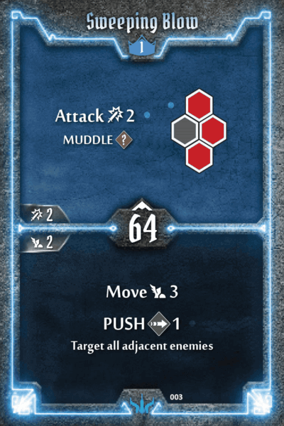

## BRUTE

**Provoking Roar:** no change. While not powerful per se, this card is solid for its initiative alone. With the buffs to armour items, I expect the bottom to indirectly benefit.

**Shield Bash, Wall of Doom:** bottom +1 Move. It is difficult to maximise the Brute's potential, given the lackluster initiatives on their movement cards. Adding +1 Move here slightly reduces the penalty for being mispositioned, brings the power level of bottom shield closer to that of Red Guard's, and reduces the Brute's reliance on the Move 3/4s.

**Sweeping Blow:** top +Muddle. The 3 hex area attacks are under the power curve. I've moved the Attack 2 Muddle forward from Level 3 (Brute Force) to Level 1 here.

**Eye for an Eye:** top changed to persistent 3x trigger. Single turn melee retaliate is awful, as you incur the risk of fizzling if the enemy doesn't draw a melee attack or goes before you. Changing it to a persistent effect makes it much more playable. 

**Fatal Advance:** top rebalanced instakill.

**Brute Force:** top +1 damage and removed Muddle. Same reason as Sweeping Blow - upping the damage is thematically appropriate and within reason power-wise. 

**Devestating Hack:** bottom add Air. Both Level 4 cards are boring, and Devestating Hack is worse for the most part. Seeing that Leaping Cleave is the only enabler for Skewer's top in the Brute's entire cardpool, adding Air generation to the bottom gives the tiniest bit of incentive to choose this over the reliable Attack 5.
