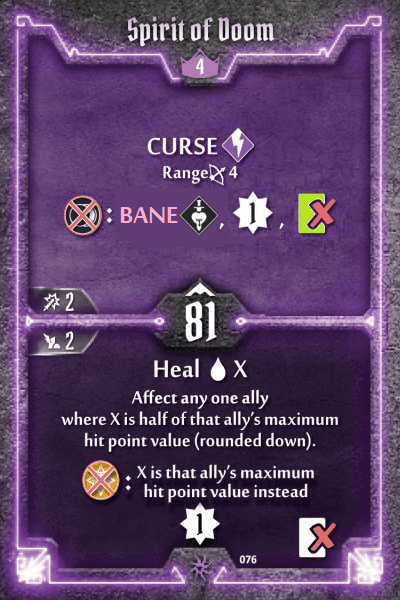

## Spellweaver

Sticking points that warrant rebalancing are:

1. **Defensive options at Level 1 have poor synergies.** The raw numbers on the defensive cards are actually solid on paper. Retaliate 2-3 on self *and* allies? Repeatable Shield 2 bottom? Not bad at all. In reality however, they're less consistent and impactful than spamming ranged attacks because they're so awkward to use:
  - **Low HP.** The Spellweaver doesn't have the health pool to make good use of Retaliate self.
  - **Antisynergistic Ice combo.** Chaining the bottom of Frost Armor with the bottom of Hardened Spikes is a low-value play. If you're negating all damage with Frost Armor already, you don't need the shield! 
  - **Antisynergistic Shield-Retaliate combo.** You could pair Frost Armor's bottom with Hardened Spikes top. Congratulations, you've just expended two loss cards to do what the Brute accomplishes with a single Wall of Doom. You can't even switch Frost Armor's bottom for the repeatable Shield 2, because they're both on the same card (Hardened Spikes)!
  - **Weak melee options.** Your only melee attack is the underwhelming Freezing Field. Why do that, when you can plink at enemies from range?
2. **Mana Bolt's initiative is ridiculous.** 07 on a bread-and-butter card makes it too easy to bypass the randomness of the enemy deck - think the 15 initiative on the Guard deck. Why bother with unreliable Shield/Retaliate when your attacks are so consistent?

At the same time however, there is a certain elegance to the Spellweaver's design as is:

3. **Elemental symmetry at Level 1.** There are 6 element-generating loss actions, one per element. There are 2 non-loss consumers for each Fire/Ice, and 1 loss consumer for each Air/Earth.
4. **Theming.** Crackling Air is obviously Fire/Air, while Hardened Spikes points towards Earth/Ice.

To address the rebalancing issues whilst retaining the elegant designs, multiple changes were made to Hardened Spikes. Perhaps science has gone too far... if anyone has less invasive means of achieving the desired outcomes above, I'm happy to hear!

**Crackling Air and Hardened Spikes:** swap the Shield and Retaliate on their bottoms. Retaliate is now tied to Ice consumption, which combos with Frost Armor. Shield is tied to Fire consumption, providing a viable alternative to Flame Strike.

**Hardened Spikes:** bottom +1 Retaliate range. This makes the retaliate much more reliable.

**Mana Bolt and Hardened Spikes:** swap initiatives. This keeps Mana Bolt in line while making the Retaliate on both halves of Hardened Spikes easier to use.

**Freezing Nova:** top +1 damage on consuming Ice. A slight nudge to incentivise bringing this otherwise frequently benched card.

**Fire Orbs:** top change to flat 2 XP. Scaling XP based on number of enemies hit is a cool mechanic, but there's not much player skill involved when the spell is Range 3 Target 3. The ranged offense build is strong enough as is, there's no need to dish out free XP on top.

**Cold Fire:** top -1 range. Multi-target ranged stun is straight up overpowered at Level 3. The range reduction makes it harder to use whilst preserving this as a strong reason to play the Spellweaver. One could justify further nerfing this to a melee ability, like Tinkerer's Flamethrower.

**Elemental Aid:** bottom allow self targeting. Now there's actually incentive to bring Retaliate self cards, such as Hardened Spikes and Engulfed in Flames.

**Spirit of Doom:** top rebalanced instakill, loss only if Dark is consumed. Single target Curse is already weak for a Level 4 top action; there's no reason to punish players by making it a loss as well. Bumping the XP gain up to 2 would be more fair, but we'll restrict ourselves from making too many changes to any single card.

**Engulfed in Flames:** bottom +1 Retaliate range. This makes the retaliate much more reliable. Since Flame Demons have innate ranged retaliate, surely a card titled "Engulfed in Flames" should work similarly!
