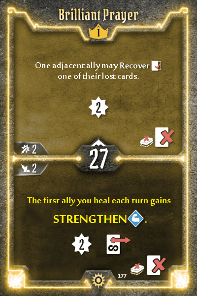
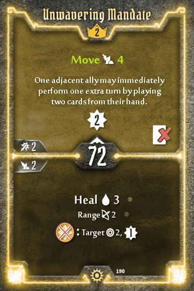

## Sunkeeper

**Defensive Stance:** bottom remove enhancement pip. Enhancements on level 1 cards have no reason being this good. In order for the Sunkeeper to retain their tanking niche, we'll move the 2nd persistent shield to Level 5.

**Tactical Order, Empowering Command, Beacon of Light, Glorious Bolt:** +10 initiative. The Sunkeeper's damage, tanking and longevity numbers are already ahead of the power curve. Instead of flattening those numbers, reinforcing the awful initiatives keeps the class reasonably balanced without hammering (forgive me) the Sunkeeper's existing strengths. 

**Brilliant Prayer:** bottom change to "The first ally you heal each turn gains Strengthen." Looking ahead to the level 2-3 cards, you'll see there's hardly any decision to be made - Unwavering Mandate and Burning Flash are utterly overshadowed by their counterparts. Adding a force multiplier to heals in Brilliant Prayer adds another niche to the Sunkeeper, making the repeatable bottom heals on those cards worth considering.

**Practical Plans:** +10 initiative. Even with this nerf, it's still above the power curve for a level 2 card. Move 5 is incredible, doubly so when you have Defensive Stance active. To make the alternative more palatable...

**Unwavering Mandate:** top +4 Move. Being a loss card, it's not going to solve all your movement problems, but it's unique in being a top move. More importantly, not taking Practical Plans should now be slightly less punishing.

**Burning Flash:** -25 initiative. Extra incentive to take this over... 

**Mobilizing Axiom:** +50 initiative. Even with this nerf, it's still very viable due to the repeatable Light generation.

**Engulfing Radiance, Righteous Strength:** swap top actions on both cards. The power level on these actions are reasonable for Level 4, but most players default to Righteous Strength due to the scarcity of move actions. To make the alternative more appealing, we now have a non-loss support action on both halves of Engulfing Radiance, offering flexibility for supportive Sunkeeper builds.

**Scales of Justice:** top +1 persistent shield. This seems controversial at first glance. But if you think about it relative to the original Sunkeeper with the bottom of Defensive Stance enhanced, it makes a lot of sense. Want the persistent 2 shield, just like before? Have it, as long as you're willing to stomach 2 losses, which isn't a problem given the 11 hand size. For players who have been leaning on the Defensive Stance + Scales of Justice retaliate-shield combo all along, the net result is exactly the same as before. In fact, they no longer have to shell out 100g for the persistent shield enhancement! With this change, the Sunkeeper can attain 1 persistent shield from levels 1-4, and 2 persistent shield from level 5 onwards - the power level now scales (again, pardon me) more fairly.
