## Elementalist

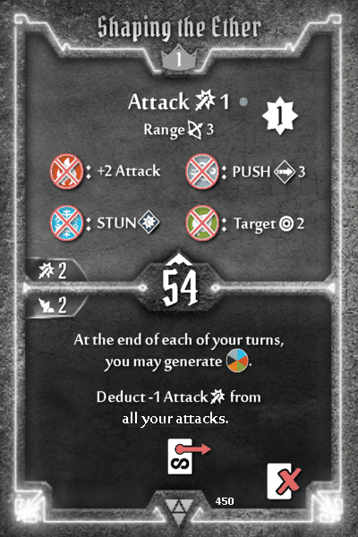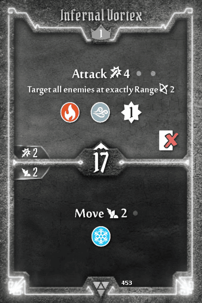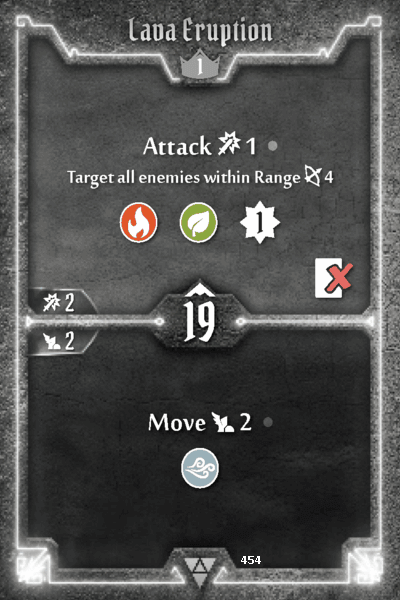

The Elementalist is fairly powerful when it has all the elements to work with, whether it be from enhancements, items or high level cards. When you have none of those however (basically a fresh level 1 character), the struggle is real. Shaping the Ether's persistent elemental generation is presumably meant to alleviate this. Unfortunately, the attack penalty makes this unusably bad. The Elementalist's toolkit consists of attacks with various flourishes - but they're all attacks at the end of the day, which makes Shaping the Ether's bottom unduly punishing.

**Raw Enhancement, Pure Augmentation, Formless Power:** top change attack to suffer damage. Probably the least intrusive way to mitigate Shaping the Ether's penalty, without changing the class's damage-centric design. This gives low level Elementalists a badly needed boost, whilst having no impact on high level characters since these don't scale with the attack modifier deck.

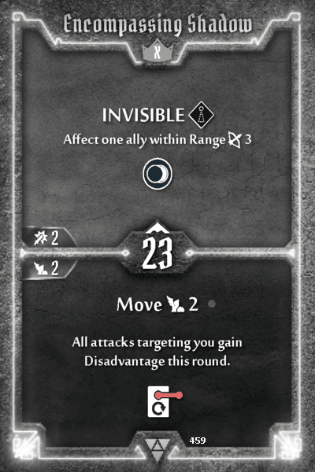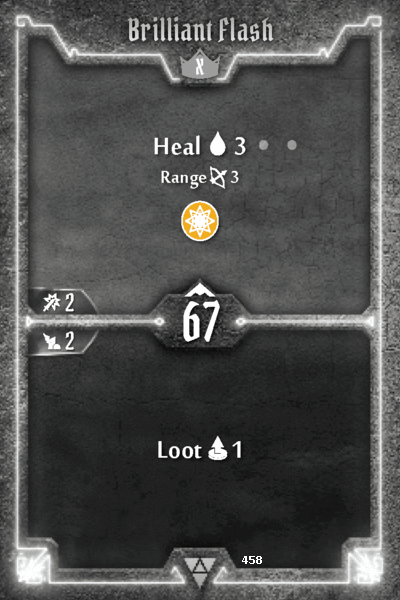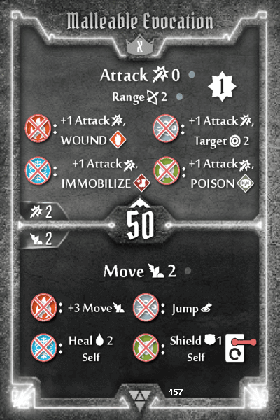

**Encompassing Shadow:** top add Strengthen. At low levels, the Elementalist's non-loss attacks do minimal damage. Giving it some viable alternatives in support cards keeps the character relevant.

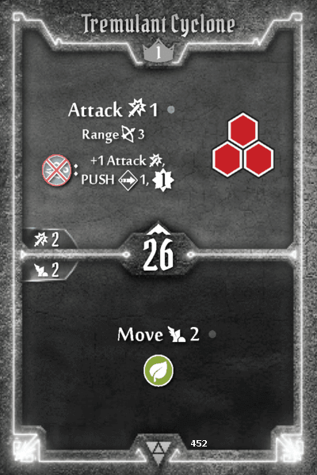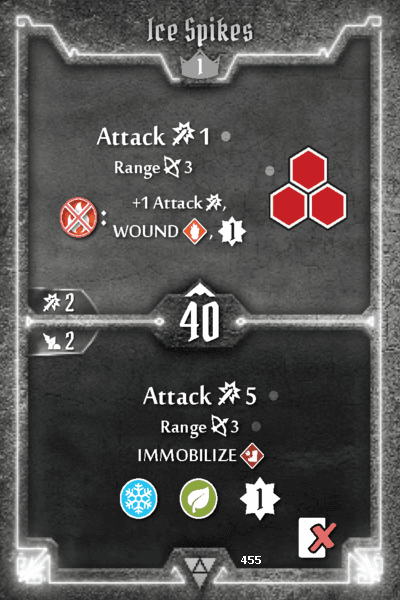

**Tremulant Cyclone:** top +1 Push. Air -> Push is pretty much outclassed by Fire -> Wound (Ice Spikes). Improving the Push makes this more situationally viable.

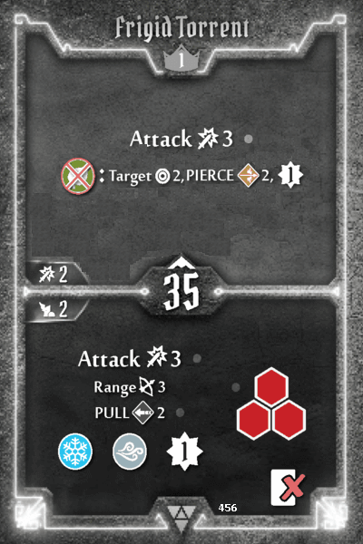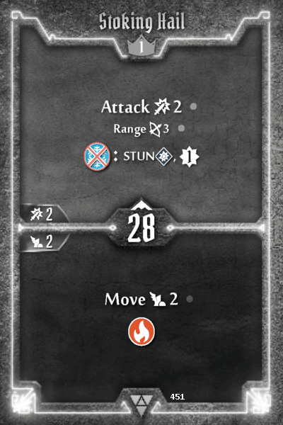

**Frigid Torrent:** top change Target 2 to 3 hex AOE. Melee attacks are a tall order for the squishy Elementalist; making it possible to hit an enemy from 2 hexes away increases the flexibility of this card.

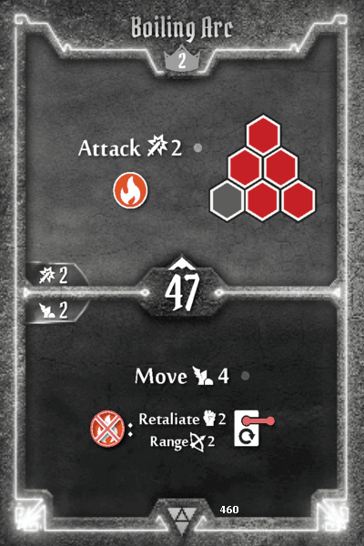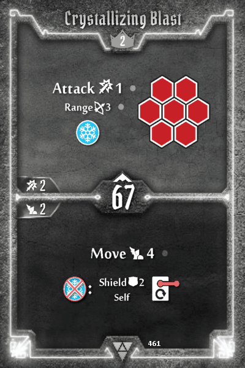

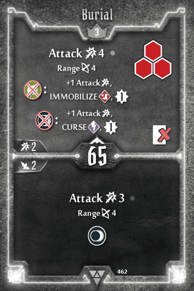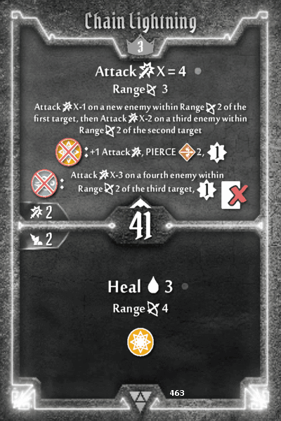

**Chain Lightning:** top +1 Attack on Air consumption. All other top elemental consumptions on the Level 3 cards have +1 Attack.

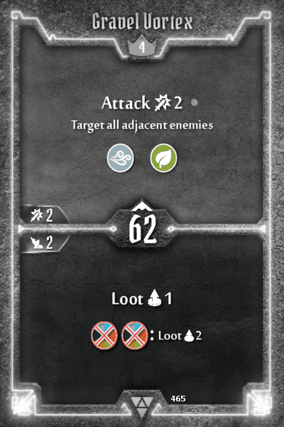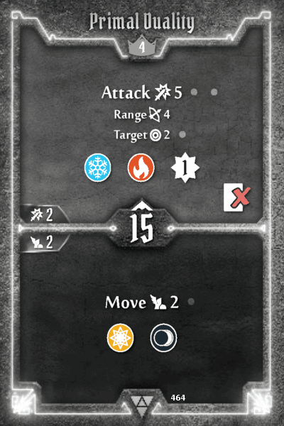

**Gravel Vortex:** top +1 Attack. Again, melee attacks are difficult for the squishy Elementalist, so bumping it up to Attack 3 is fair.
