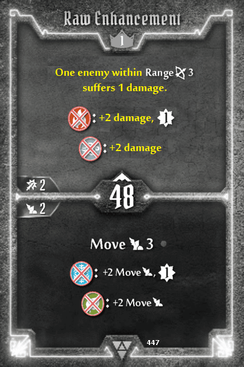
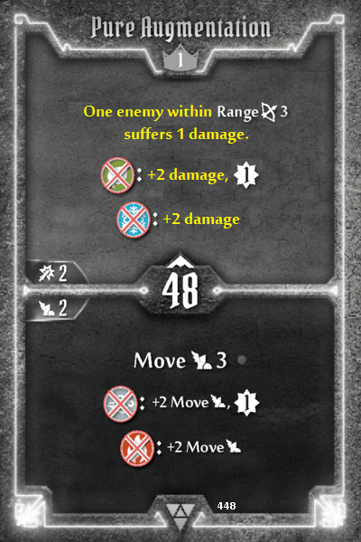
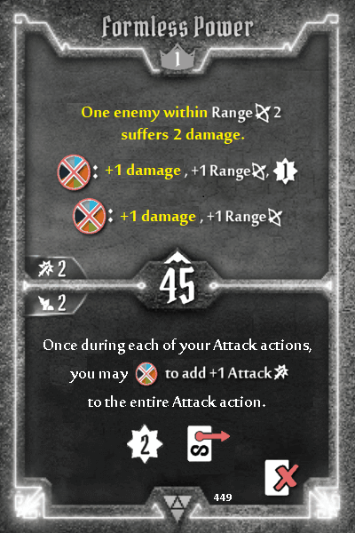

## Elementalist

The Elementalist is fairly powerful when it has all the elements to work with, whether it be from enhancements, items or high level cards. When you have none of those  (basically a fresh level 1 character) the struggle is real. Shaping the Ether's persistent elemental generation is presumably meant to alleviate this. Unfortunately, the attack penalty makes this unusably bad. The Elementalist's toolkit consists of attacks with various flourishes - but they're all attacks at the end of the day, which makes Shaping the Ether's bottom unduly punishing.

**Raw Enhancement, Pure Augmentation, Formless Power:** top change attack to suffer damage. This is probably the least intrusive way to mitigate Shaping the Ether's penalty, without changing the class's damage-focused nature

